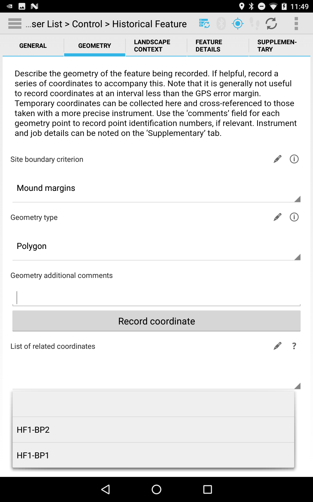
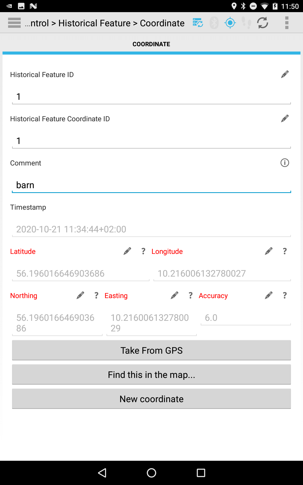

# Phase 1 Module: Historical Features

_This module represents a digital workflow recording historical features in the colonial Cape York, Australia_

## Contact info:
For more details about **Indigenous foodways in colonial Cape York Peninsula** project, please visit http://capeyorkpeninsula.org/.

## Screenshots of the 2020 version:

_In 2020 module got updated to better correspond with in-field requirements of the team (after getting feedback from an extensive first season)_

    

    

