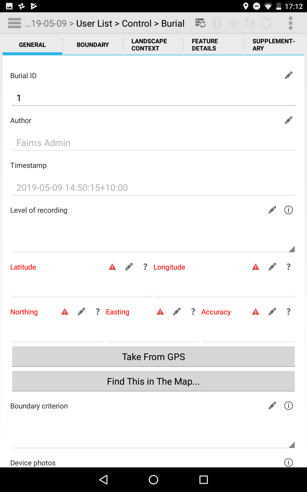

# Phase 2 Module

_[Phase 2 Module](https://github.com/FAIMS/Indigenous-foodways-landscape-survey/tree/master/Phase_2_modules/Phase-2-Object-Recording) represents a complex workflow, combining digital recording of the following archaeological objects in the field:_

* Flaked Stone Artefact
* Other Stone Artefact
* Knapped Glass Artefact
* Discrete Hearth Feature
* Glass Artefact
* Ceramic Artefact
* Buttons
* Metal Artefact
* Weapons and Ammunition
* Miscellaneous Artefact

## Contact info:
For more details about **Indigenous foodways in colonial Cape York Peninsula** project, please visit http://capeyorkpeninsula.org/.

## Screenshots of the 2019 version

_In 2019 the module was created ready to be used in the field at Cape York_

    

    

    

## Screenshots of the 2020 version

_In 2020 module got updated to better correspond with in-field requirements of the team (after getting feedback from an extensive first season)_

    

    

    

    

### Screenshots from the module testing:   

_Dr Brian Ballsun-Stanton testing at Macquarie University (2019)_

