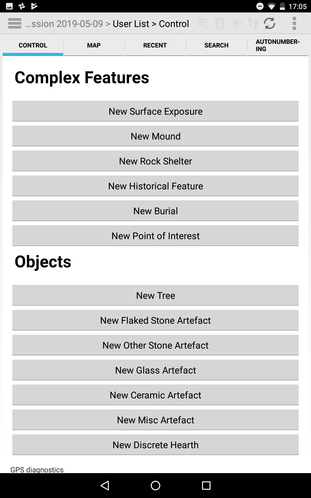
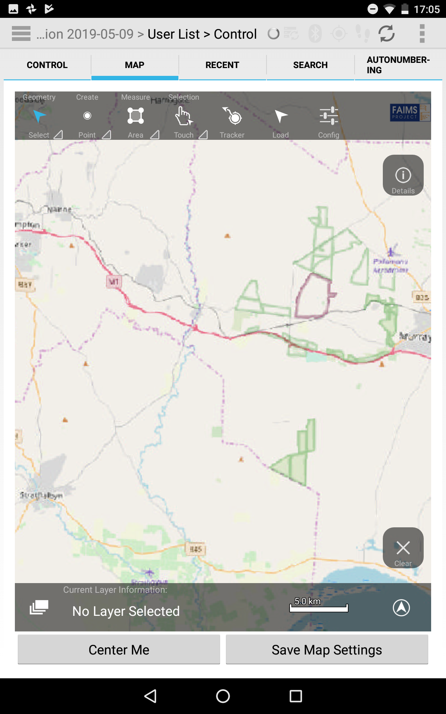
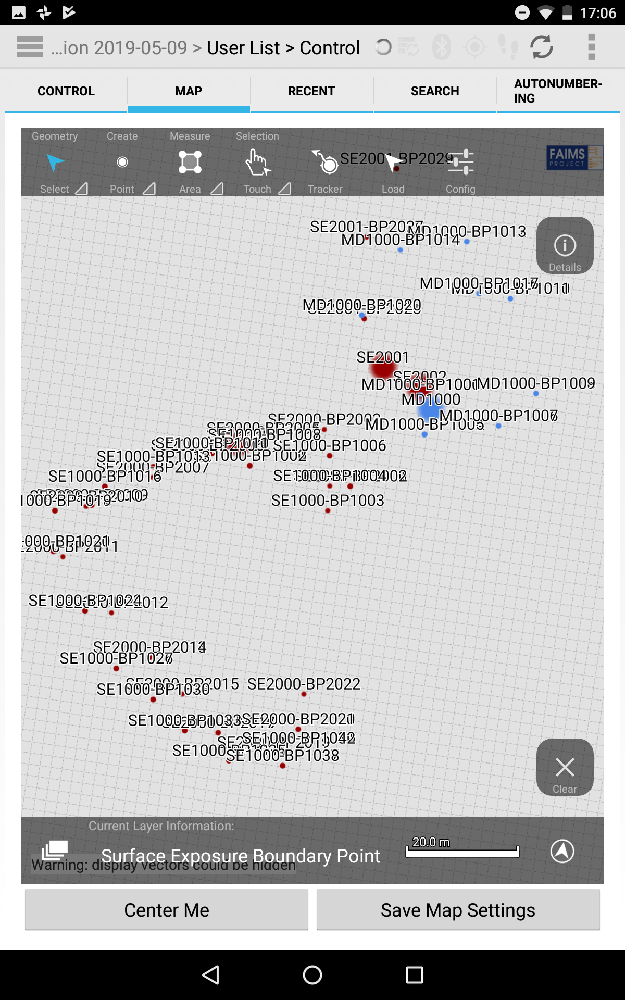
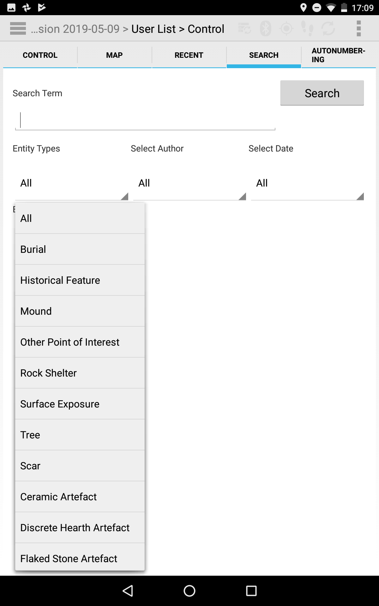
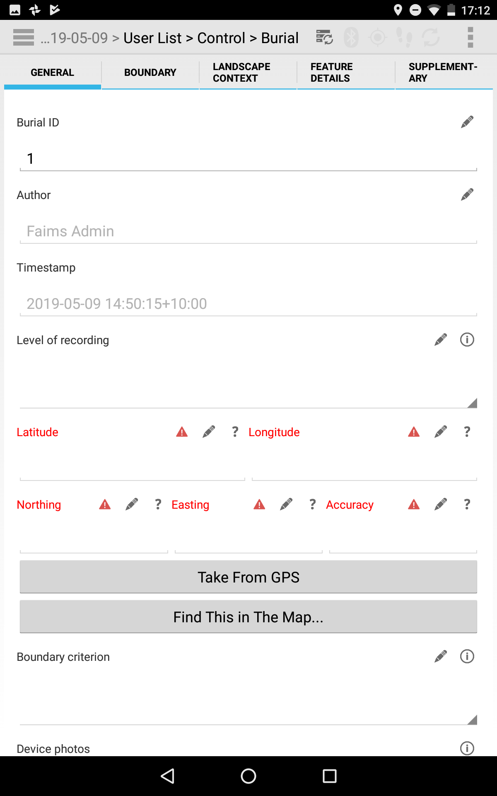
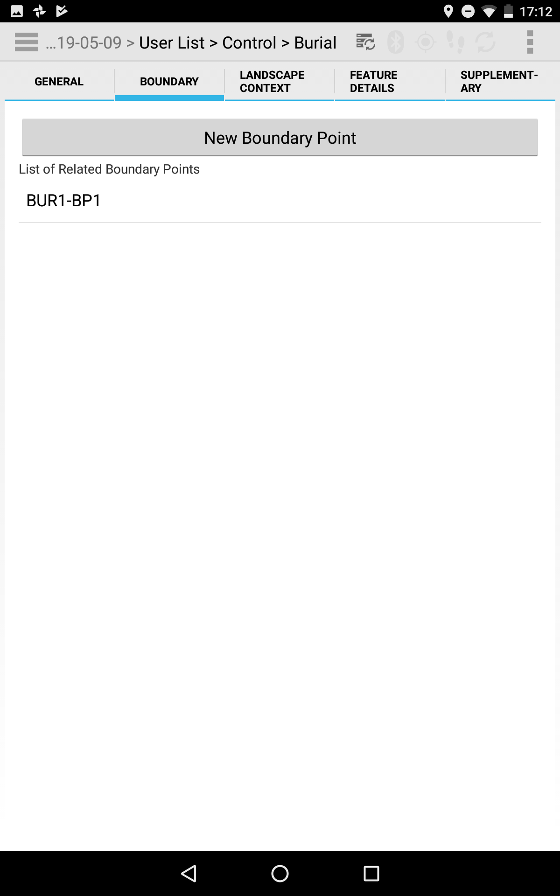
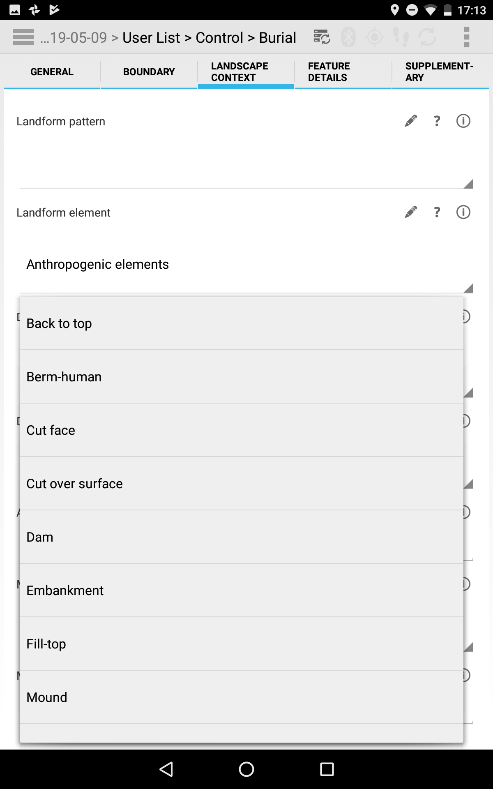
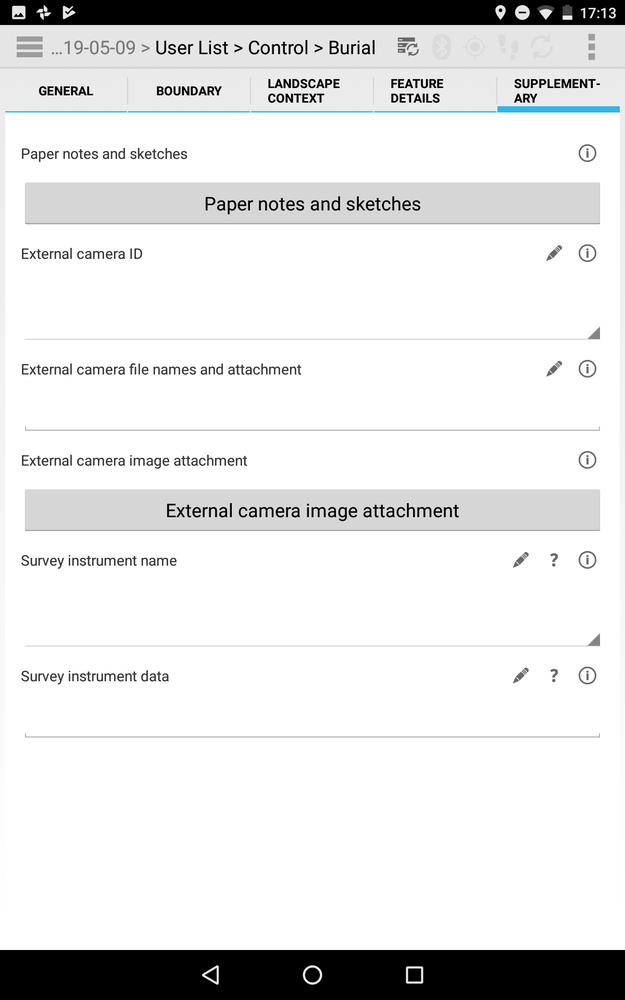

# About this Module

This module was created for the **Indigenous foodways in colonial Cape York Peninsula** project, based at Flinders University. This module has been designed for landscape survey. 

### Indigenous foodways in colonial Cape York Peninsula. 

This project aims to trace historical Indigenous foodways in colonial Cape York Peninsula, Queensland, through a program of collaborative community-based archaeological and anthropological research. Food was a key medium for cultural exchanges between Indigenous peoples and settler-colonists. The analysis of foodways is known to provide unparalleled insights on daily life, as well as the development of both cultural values and social relationships. This has received limited attention in archaeological investigations in Australia. Results will provide greater insight into the history behind our current society.

## Authorship

This module was developed by Mick Morrison (Flinders), Shawn Ross (Macquarie), Brian Ballsun-Stanton (Macquarie), and Ana Stevanovic (Macquarie).

## Funding

Development of this module was funded by the **Australian Research Council** Linkage Project Grant LP170100050: Indigenous foodways in colonial Cape York Peninsula. 

## Date of release
July 2019

## FAIMS Mobile Version
FAIMS **v2.6** (Android 7+)

## Licence:
This module is licensed under an international Creative Commons Attribution 4.0 Licence (**CC BY 4.0**).

## This module contains the following FAIMS features: 
* attribute-level timestamps
* photo capture from device camera
* controlled vocabularies
* GIS integration
    - Center map on record
    - Load record from map
* autonumbering validation
* Cascading delete of child records
* Custom Search
* Recent records

## Contact info:

For more details about **Indigenous foodways in colonial Cape York Peninsula** project, please visit http://capeyorkpeninsula.org/

## Screenshots

